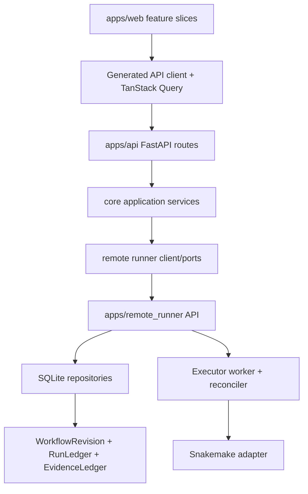
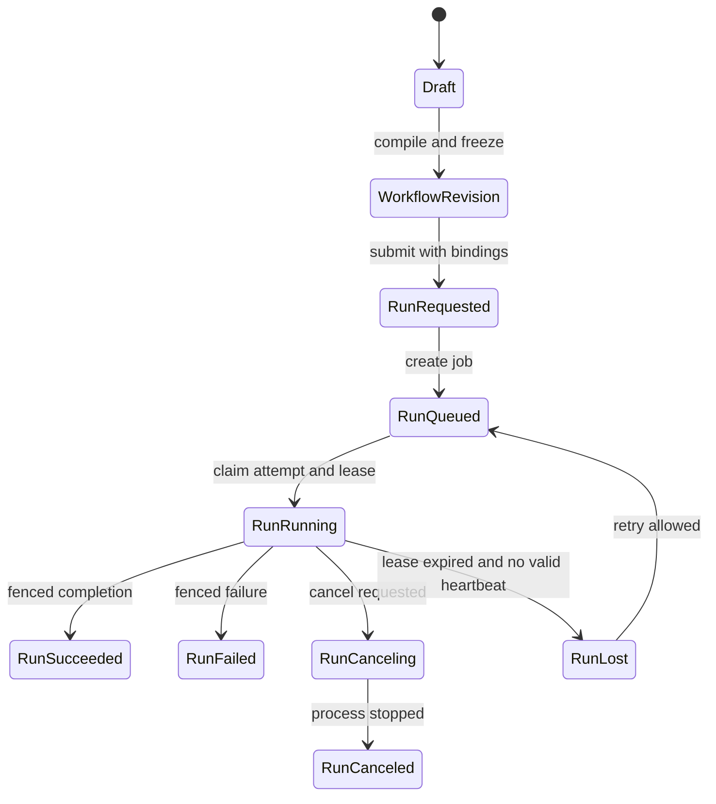

# H2OMeta Architecture Transformation Plan

> **For agentic workers:** REQUIRED SUB-SKILL: Use superpowers:executing-plans to execute this plan.

**Goal:** Rebuild H2OMeta around durable workflow revisions, an append-only run ledger, fenced execution attempts, explicit resource reconciliation, generated API contracts, and a frontend state model that can scale without turning the current codebase into a distributed-platform rewrite.

**Current repo anchors:**
- Frontend is in `apps/web`.
- Backend API is in `apps/api`.
- Local runtime and orchestration facade are in `core`.
- Remote runner service is in `apps/remote_runner`.
- Existing accepted boundary ADR: `docs/adr/2026-06-06-draft-asset-run-boundary.md`.
- Existing draft contract: `docs/workflow-design-draft-v1.md`.
- Existing runner release policy: `docs/managed-workflow-runtime-runbook.md`.

**Architecture direction:** Feature-sliced Web UI -> generated API client/query layer -> typed API contracts -> application services -> remote runner source of truth -> immutable workflow revisions + append-only run ledger -> fenced run attempts/executor -> evidence/policy/provenance.

**Tech stack stance:**
- Keep FastAPI, SQLite, Snakemake, Next.js, Tailwind, shadcn/ui.
- Add generated TypeScript API clients from OpenAPI.
- Add TanStack Query for server state.
- Add a small explicit port/repository layer around runner storage.
- Do not add Temporal, Kubernetes CRD, Argo, Nextflow, CWL, or Redis as mandatory platform dependencies in the first 90 days.
- Design a `TaskQueuePort` seam so Dramatiq + Redis can be adopted later if the local durable worker becomes the bottleneck.

---

## 0. v2 Hardening Decisions

These changes are mandatory before the durable architecture should be treated as production-ready. They come from architecture review and supersede v1 wording where there is a conflict.

1. Use `WorkflowRevision`, not `AssetRevision`, for immutable compiled workflows. Reserve `Asset` for data assets, artifact blobs, database versions, and future DRS/RO-Crate objects.
2. Fencing must protect both database writes and the filesystem. Every attempt writes into an attempt-scoped working directory, and terminal publish is atomic and gated by the current lease generation. Expired attempts must have their process group killed before another attempt can publish.
3. Output recovery must use `candidate_outputs -> verify -> adopt`, never “file exists, therefore artifact.” Candidate outputs from fenced or crashed attempts are recorded with paths and checksums, verified against expected outputs and Snakemake dry-run/manifest metadata, then promoted to official artifacts only after verification.
4. Resource envelopes must include lifecycle and ownership metadata from the start: `finalizers_json`, `deletion_timestamp`, `owner_kind`, `owner_id`, and `conditions_json`.
5. `reconcile_queue` must deduplicate work and use bounded exponential backoff with jitter. It must never busy-loop on a failing reconcile item.
6. Artifact materialization must include `storage_backend` and `storage_uri` from the first version, even while the only backend is `local`/`file://`.
7. Lineage should be modeled as a run-artifact bipartite graph: `run_artifact_edges(run_id, artifact_blob_id, role, port_name, step_id, content_hash)` with optional denormalized `upstream_run_id` for query speed.
8. Frontend generated clients should use `@hey-api/openapi-ts` with its TanStack Query plugin and exact package versions. Codegen and TanStack Query migration belong in one PR so generated query keys/options are the server-state boundary.
9. TanStack Query does not remove polling; it makes polling explicit and controllable: pause in background, refetch on focus, stop on terminal states, and poll running runs at about 3 seconds.
10. Frontend structure should move toward `shared/ + entities/ + features/`, not a flat `features/` bucket, so Run, Tool, Artifact, Problem, and WorkflowRevision models have stable ownership.
11. Problem responses and UI problem records should align with RFC 9457 fields: `type`, `status`, `title`, `detail`, and `instance`, with `code`, `severity`, `resourceRef`, `command`, and `actions` as extensions.
12. Large-file internal cache hashes may use BLAKE3 for speed, but manifest/security/provenance hashes remain SHA-256.
13. Lease failure modes must include clock jumps. In-process scheduling uses monotonic time; persisted leases use wall-clock timestamps; the reconciler must detect suspicious mass expiry after clock jumps.

---

## 1. Diagnosis

The current architecture has the right product instincts, but several responsibilities are still fused together.

### 1.1 Runtime facade is too command-oriented

`core/app_runtime/service.py` already uses mixins and managers, but it is still a mutable command facade. `RuntimeService` owns process/session/runner/system state, while managers call back into service private state through `core/app_runtime/managers/base.py`.

This makes operations like bootstrap, run submission, terminal sessions, and readiness look like direct commands. The next architecture should make desired state explicit:

- user wants a remote runtime connected
- a workflow draft should compile into an immutable workflow revision
- a run should exist for a workflow revision
- an executor should claim one run attempt
- reconciler should observe, diff, and repair

### 1.2 Remote runner is the actual control plane, but not yet durable enough

`apps/remote_runner/storage_schema.py` has useful tables:

- `runs`
- `run_events`
- `artifacts`
- `idempotency`
- `workflow_design_drafts`
- tool preparation tables

But it lacks the tables needed to recover and fence execution safely:

- `run_jobs`
- `run_attempts`
- `run_leases`
- `resources`
- `resource_events`
- `reconcile_queue`
- immutable `workflow_revisions`

`apps/remote_runner/executor.py` starts daemon threads and uses a process-wide `SNAKEMAKE_EXECUTION_LOCK`. This is acceptable for early local execution, but it cannot reliably support cancellation, heartbeat, fencing, lease recovery, or split-brain protection.

### 1.3 Draft, workflow revision, run, and provenance are not fully separated

The accepted ADR already says the lifecycle should be:

`WorkflowDesignDraft -> immutable workflow revision -> run ledger facts`

The code has mutable draft storage in `apps/remote_runner/workflow_design_storage.py`, run storage in `apps/remote_runner/workflow_run_storage.py`, and plan-only compile semantics in docs. The missing step is the durable workflow revision ledger.

The key product rule should become:

Runs execute immutable workflow revisions, not mutable drafts and not caller-supplied ad hoc workflow bodies.

### 1.4 API contracts leak implementation modules

`apps/api/models.py` imports `WorkflowDesignDraftV1` from `apps.remote_runner.workflow_design_contract`. This is a boundary smell. API models, remote runner contracts, and frontend generated types need one stable contract surface.

Near-term target:

- create a contract package/module owned by the repo, not by `apps/api` or `apps/remote_runner`
- make API request/response models import from that contract layer
- generate frontend types from FastAPI OpenAPI, not by hand

### 1.5 Frontend is already close to feature slicing, but lacks generated server-state boundaries

The frontend already has useful local conventions:

- thin route pages
- `*-page-api.ts`
- `*-page-model.ts`
- `use-*-page-state.ts`
- `*-page-ui.tsx`

Largest UI files are near the repo source-size guardrail:

- `apps/web/app/workflows/tools/tools-page-ui.tsx`
- `apps/web/app/components/ssh-shell-ui.tsx`
- `apps/web/app/workflows/detail/workflow-dag-preview.tsx`
- `apps/web/app/workflows/generated/generated-workflow-builder.tsx`

The next frontend move should not be a full rewrite. It should introduce generated API types and TanStack Query first, then split high-change domains:

- catalog
- design
- run
- artifact
- graph
- workbench

---

## 2. Target Architecture

### 2.1 Runtime levels



The backend should not duplicate runner truth. It should command the runner and read runner projections.

### 2.2 Lifecycle model



### 2.3 Durable primitives

The remote runner should become the source of truth for:

- `workflow_design_drafts`: mutable user design state
- `workflow_revisions`: immutable compiled workflow artifacts
- `runs`: current projection of run state
- `run_events`: append-only event ledger
- `run_jobs`: queueable durable execution intents
- `run_attempts`: each worker claim/try
- `run_leases`: heartbeat and fencing generation
- `artifacts`: materialized outputs
- `resources`: desired/observed control-plane objects
- `resource_events`: state changes for resources
- `reconcile_queue`: durable work for reconcile loops
- `evidence_events`: policy/provenance/security facts
- `policy_overrides`: explicit audited escape hatch

### 2.4 Control-plane loop

Commands should only record desired state. Reconcilers perform effects.

Example:

1. API receives run request for `workflowRevisionId`.
2. Storage transaction creates run, event, and job.
3. Worker claims one job by creating an attempt and lease generation.
4. Executor starts process with attempt token.
5. Heartbeat updates lease.
6. Completion writes result only if attempt generation is still current.
7. Reconciler observes stale leases, orphaned processes, missing artifacts, and incomplete projections.

This gives deterministic recovery after process restart and makes failure cases testable.

---

## 3. Hard Non-Goals

These are rejected for the first 90 days:

- Do not move to Kubernetes/CRD. Current product and launcher are not Kubernetes-native.
- Do not adopt Temporal as the main workflow runtime. It solves a different orchestration layer and would fight Snakemake semantics.
- Do not switch default execution to Argo, Nextflow, or CWL.
- Do not create an engine-independent DSL before the workflow revision ledger is stable.
- Do not add silent fallback paths for old run payloads.
- Do not make Redis mandatory before local SQLite durability is proven insufficient.
- Do not build dual-database SQLite/Postgres runtime. Make the schema portable, not both databases active.

These can be revisited after the first durable architecture is working:

- Dramatiq + Redis as a `TaskQueuePort` implementation
- DRS-compatible object access
- RO-Crate export
- CWL or Nextflow export
- React Flow based graph editor
- Postgres deployment mode

---

## 4. Phase 0: Architecture Guardrails (2-4 days)

Phase 0 makes the rest of the work safer. It should be merged before schema and executor changes.

### PR 0.1: Add Architecture Roadmap ADR

Create:

- `docs/adr/2026-06-07-durable-control-plane-roadmap.md`

Content:

- accept `Draft -> WorkflowRevision -> RunLedger`
- define remote runner as run source of truth
- reject Kubernetes/Temporal/mandatory Redis for first 90 days
- define Workflow IR as metadata projection only before 90 days
- define no silent legacy payload fallback

Acceptance:

- ADR references `docs/adr/2026-06-06-draft-asset-run-boundary.md`
- ADR names the first three durable tables to add: `run_attempts`, `run_leases`, `workflow_revisions`
- ADR explicitly states old ad hoc executable run payloads must fail loudly once v2 submit is enabled

### PR 0.2: Add Contract Boundary Test

Add or extend tests so `apps/api` cannot import contract models from `apps.remote_runner`.

Likely files:

- `tests/test_api_contract_boundaries.py`
- `apps/api/models.py`
- new `core/contracts/` or `apps/contracts/`

Acceptance:

- importing `apps/api/models.py` does not import `apps.remote_runner.workflow_design_contract`
- API models import shared contracts from the new contract layer
- boundary test fails if `apps/api` imports from `apps.remote_runner`

Suggested test assertion:

```python
def test_api_models_do_not_import_remote_runner_contracts():
    import ast
    from pathlib import Path

    tree = ast.parse(Path("apps/api/models.py").read_text())
    imports = [
        node.module
        for node in ast.walk(tree)
        if isinstance(node, ast.ImportFrom) and node.module
    ]
    assert "apps.remote_runner.workflow_design_contract" not in imports
```

### PR 0.3: Define Event Naming and Version Rules

Create:

- `apps/remote_runner/event_contracts.py`
- `tests/test_remote_runner_event_contracts.py`

Rules:

- every event has `event_type`
- every event has `schema_version`
- every event has `occurred_at`
- every command-derived event has `command_id`
- every correlation-worthy event has `correlation_id`
- event payloads are JSON objects

Acceptance:

- existing run event writes can still write v1 fields during transition
- new event appender supports v2 metadata
- tests cover deterministic event sequence assignment

---

## 5. Phase 1: Durable Run Core (Days 1-30)

This phase is intentionally narrower than the earlier 30-day proposal. It should deliver the durable correctness foundation only:

1. idempotent run submission that cannot double-start execution
2. queue/attempt/lease/fencing foundation
3. resource envelope tables with lifecycle ownership fields
4. reconcile queue semantics that cannot busy-loop
5. shadow reconciler observations for stale leases and suspicious clock jumps

Do not include workflow revision ledger, policy UI, manifest v2, Problems panel, or frontend rewrite in this phase.

### PR 1.1: Harden Idempotent Submission

Problem:

`apps/remote_runner/workflow_run_storage.py` has `idempotency`, but the whole submission path must prove that duplicate requests cannot start a second executor thread.

Likely files:

- `apps/remote_runner/workflow_run_storage.py`
- `apps/remote_runner/executor.py`
- `apps/remote_runner/api.py` or runner route module
- `apps/api/services/submission_service.py`
- tests around runner storage and submission

Implementation:

- make `create_run_record` return a typed result:
  - `created=True, run_id=...`
  - `created=False, run_id=..., reason="idempotency_replay"`
- only enqueue/start execution when `created=True`
- keep payload hash conflict as hard error
- add a unique constraint on idempotency key scope if not already complete
- add submission tests that simulate duplicate calls

Acceptance:

- repeating the same idempotency key and identical payload returns the same run id
- duplicate replay does not create a second run row
- duplicate replay does not create a second queued job
- duplicate replay does not call the executor
- same idempotency key with different payload returns a conflict

Suggested test names:

- `test_duplicate_idempotency_key_replays_existing_run_without_enqueue`
- `test_idempotency_key_payload_mismatch_is_conflict`
- `test_api_duplicate_submission_does_not_start_second_execution`

Verification from WSL Codex CLI:

```bash
export UV_PROJECT_ENVIRONMENT=/tmp/bio_ui_codex_uv_venv_pytest
export UV_CACHE_DIR=/tmp/bio_ui_codex_uv_cache
unset UV_PYTHON
export UV_PYTHON_INSTALL_DIR=/tmp/bio_ui_codex_uv_python
uv run pytest tests/test_remote_runner_workflow_run_storage.py tests/test_remote_runner_api_lifecycle.py -q
```

### PR 1.2: Add Run Jobs, Attempts, and Leases

Problem:

Daemon threads plus a global execution lock cannot represent durable execution. We need a queue record, attempt record, heartbeat, and fencing generation.

Likely files:

- `apps/remote_runner/storage_schema.py`
- new `apps/remote_runner/run_job_storage.py`
- new `apps/remote_runner/run_attempt_storage.py`
- `apps/remote_runner/workflow_run_storage.py`
- tests for claim/lease/fence behavior

Schema shape:

```sql
run_jobs(
  job_id text primary key,
  run_id text not null,
  state text not null,
  priority integer not null default 0,
  available_at text not null,
  created_at text not null,
  updated_at text not null
)

run_attempts(
  attempt_id text primary key,
  run_id text not null,
  job_id text not null,
  lease_generation integer not null,
  state text not null,
  worker_id text not null,
  work_dir text not null,
  process_group_id text,
  started_at text,
  finished_at text,
  exit_code integer,
  fenced_reason text,
  created_at text not null,
  updated_at text not null
)

run_leases(
  run_id text primary key,
  attempt_id text not null,
  lease_generation integer not null,
  worker_id text not null,
  heartbeat_at text not null,
  expires_at text not null,
  state text not null,
  updated_at text not null
)
```

Implementation:

- `enqueue_run_job(run_id)` creates one job per newly created run
- `claim_next_job(worker_id, now)` atomically:
  - picks an available queued job
  - creates a run attempt
  - increments lease generation
  - updates job state to `claimed`
  - appends `run_attempt_claimed`
- `heartbeat_attempt(attempt_id, generation)` only succeeds for current generation
- `complete_attempt(attempt_id, generation, result)` only succeeds for current generation
- stale completion writes `attempt_fenced` and does not change `runs` final state
- every attempt gets an attempt-scoped `work_dir`
- worker records `process_group_id` when the engine process starts
- reclaiming an expired lease must mark the old attempt fenced before the new attempt can publish

Acceptance:

- two workers cannot claim the same queued job
- lease generation increments monotonically
- stale worker completion is fenced and cannot mark run succeeded
- heartbeat with old generation is rejected
- stale worker completion cannot publish artifacts or shared output paths
- a new attempt does not reuse the old attempt work directory
- all state transitions append events

Suggested test names:

- `test_claim_next_job_is_atomic`
- `test_stale_attempt_completion_is_fenced`
- `test_lease_generation_increments_after_reclaim`
- `test_old_heartbeat_cannot_extend_new_lease`

### PR 1.3: Introduce Append-Only Run Event Appender

Problem:

`run_events` exists, but it should become a proper ledger with sequence numbers and versioned payloads.

Likely files:

- `apps/remote_runner/storage_schema.py`
- new `apps/remote_runner/run_event_log.py`
- `apps/remote_runner/workflow_run_storage.py`
- tests for event sequencing

Schema additions:

- `seq integer not null`
- `schema_version integer not null`
- `command_id text`
- `correlation_id text`
- `actor text`
- unique index on `(run_id, seq)`

Implementation:

- add `append_run_event(conn, run_id, event_type, payload, ...)`
- compute next `seq` inside the same transaction
- use JSON serialization through one helper
- keep `runs` as a projection/cache

Acceptance:

- events for one run have contiguous sequence numbers
- event payloads are valid JSON objects
- event appender can be used inside existing storage transactions
- projection update and event append happen atomically where needed

### PR 1.4: Add Resource Envelope Tables

Problem:

Bootstrap/readiness/runtime state should be expressed as resources and reconciled over time, not only as command-side imperative state.

Likely files:

- `apps/remote_runner/storage_schema.py`
- new `apps/remote_runner/resource_storage.py`
- new `apps/remote_runner/resource_contracts.py`
- tests for resources/reconcile queue

Schema shape:

```sql
resources(
  resource_id text primary key,
  kind text not null,
  name text not null,
  desired_json text not null,
  observed_json text not null,
  status text not null,
  owner_kind text,
  owner_id text,
  finalizers_json text not null default '[]',
  deletion_timestamp text,
  conditions_json text not null default '[]',
  generation integer not null,
  observed_generation integer not null,
  created_at text not null,
  updated_at text not null
)

resource_events(
  event_id text primary key,
  resource_id text not null,
  seq integer not null,
  event_type text not null,
  payload_json text not null,
  occurred_at text not null
)

reconcile_queue(
  item_id text primary key,
  resource_id text not null,
  dedup_key text not null,
  reason text not null,
  available_at text not null,
  claimed_by text,
  claimed_until text,
  attempts integer not null default 0,
  backoff_seconds integer not null default 1,
  max_attempts integer not null default 12,
  jitter_seed text not null,
  last_error text,
  created_at text not null,
  updated_at text not null,
  unique(dedup_key)
)
```

First resource kinds:

- `RemoteRuntime`
- `RunnerRelease`
- `WorkflowRuntime`
- `RunJob`

Acceptance:

- applying the same resource desired state is idempotent
- changing desired state increments generation
- resource event seq is contiguous per resource
- reconcile queue deduplicates pending work for the same resource/reason
- marking a resource for deletion sets `deletion_timestamp` and keeps finalizers until cleanup completes
- owner fields can express `RunJob -> Run` and `RunnerRelease -> RemoteRuntime`
- failed reconcile items use bounded exponential backoff with jitter and eventually stop retrying

### PR 1.5: Shadow Reconciler

Problem:

Before replacing behavior, introduce the reconciler in shadow mode so it observes and reports without taking destructive action.

Likely files:

- new `apps/remote_runner/reconciler.py`
- new `apps/remote_runner/reconciler_rules.py`
- runner startup module
- tests for stale lease detection

Initial rules:

- queued job has no current lease -> eligible to claim
- running lease expired -> mark candidate lost or reclaimable
- attempt heartbeat stale but process unknown -> emit `run_lease_expired_observed`
- run projection missing terminal event -> enqueue projection repair
- many leases expiring at once after wall-clock jump -> emit `clock_jump_suspected`

Acceptance:

- reconciler can run once in tests with deterministic clock
- stale lease is observed and reported
- suspicious mass lease expiry is observed without immediately failing all runs
- shadow mode does not kill processes
- shadow mode does not mark runs terminal unless the repair is purely derived from ledger facts

---

## 6. Phase 2: Executor and Immutable Workflow Revisions (Days 31-60)

Phase 2 turns the durable foundation into real execution semantics and freezes workflow revisions before execution.

### PR 2.1: Replace Daemon Thread Execution with Worker Loop

Problem:

`apps/remote_runner/executor.py` starts daemon threads directly. The worker should consume `run_jobs`.

Likely files:

- `apps/remote_runner/executor.py`
- `apps/remote_runner/run_worker.py`
- `apps/remote_runner/run_job_storage.py`
- runner startup/shutdown code
- tests with fake engine adapter

Implementation:

- add a worker loop that claims jobs through storage
- one active execution remains acceptable at first
- worker sends heartbeat while engine runs
- worker writes attempt result through fenced completion
- duplicate API replays do not interact with worker

Acceptance:

- newly submitted run creates queued job
- worker claims and runs fake engine
- heartbeat updates lease while fake engine is running
- completion succeeds only for current generation
- worker restart can pick up a queued job

### PR 2.2: Evolve Snakemake Adapter to Process Handle

Problem:

`apps/remote_runner/workflow_engine_adapter.py` wraps `subprocess.run`, which cannot stream logs or cancel cleanly.

Likely files:

- `apps/remote_runner/workflow_engine_adapter.py`
- `apps/remote_runner/executor.py`
- new process utility module if needed
- tests with fake process/adapter

Implementation:

- introduce `EngineRunHandle` protocol
- use `subprocess.Popen`
- create process group where supported
- stream stdout/stderr to log events or log files
- support cancellation token
- collect exit code and final status
- write all engine outputs into the attempt-scoped working directory
- publish terminal outputs with an atomic directory rename or manifest promotion after lease-generation validation

Acceptance:

- cancellation request transitions run to canceling
- process receives cancellation signal
- canceled attempt cannot later write success
- stdout/stderr are available through current artifact/log route or a new log route
- expired attempt process group is killed before a replacement attempt can publish
- a stale attempt can leave candidate files but cannot update official artifact rows

### PR 2.3: Add Fenced Output Reconciliation

Problem:

Filesystem state can outlive an attempt. A fenced worker may have produced useful files, but adopting them blindly can corrupt provenance. Output reconciliation must make adoption explicit and verifiable.

Likely files:

- `apps/remote_runner/storage_schema.py`
- new `apps/remote_runner/output_reconciliation.py`
- new `apps/remote_runner/candidate_output_storage.py`
- `apps/remote_runner/executor.py`
- tests for candidate output adoption/rejection

Schema shape:

```sql
candidate_outputs(
  candidate_output_id text primary key,
  run_id text not null,
  attempt_id text not null,
  output_key text not null,
  path text not null,
  size_bytes integer,
  sha256 text,
  observed_at text not null,
  verification_state text not null,
  verification_json text not null default '{}'
)
```

Implementation:

- fenced or crashed attempts record candidate output paths and checksums
- reconciler runs `verify_candidate_outputs(run_id, attempt_id)`
- verification compares expected output keys, path constraints, size/checksum, and Snakemake dry-run or compiled manifest expectations
- only `adopt_verified_outputs(...)` can promote candidates into official `artifacts`
- rejected candidates remain audit records and are never silently deleted

Acceptance:

- fenced attempt output is recorded as a candidate, not an artifact
- missing expected output rejects adoption
- checksum mismatch rejects adoption
- verified candidate output is promoted to artifact with evidence and lineage edges
- adoption is idempotent and cannot create duplicate artifacts

### PR 2.4: Add Immutable Workflow Revision Ledger

Problem:

Runs must execute immutable workflow revisions, not mutable drafts.

Likely files:

- `apps/remote_runner/storage_schema.py`
- new `apps/remote_runner/workflow_revision_contract.py`
- new `apps/remote_runner/workflow_revision_storage.py`
- compiler/plan endpoint modules
- tests for workflow revision immutability

Schema shape:

```sql
workflow_revisions(
  workflow_revision_id text primary key,
  draft_id text,
  draft_revision integer,
  content_hash text not null,
  manifest_json text not null,
  graph_snapshot_json text not null,
  runtime_lock_json text not null,
  compiler_json text not null,
  created_by text,
  created_at text not null
)
```

Workflow revision manifest should include:

- draft id/revision
- semantic graph snapshot
- generated Snakefile or workflow entrypoint hash
- tool revision references
- runtime lock references
- input binding schema
- compiler name/version
- creation timestamp

Acceptance:

- compiling the same draft revision deterministically creates the same content hash
- workflow revision rows are immutable
- modifying a draft after compile does not alter prior workflow revision
- workflow revision can be fetched by id and validated

### PR 2.5: Submit Runs by Workflow Revision

Problem:

`apps/api/models.py` currently allows run specs containing `workflowDesign` and `workflow`. That keeps execution tied to mutable or caller-supplied content.

Likely files:

- `apps/api/models.py`
- `apps/api/routes/submission.py`
- `apps/api/services/submission_service.py`
- remote runner run request models/routes
- frontend run submission call sites
- tests for rejected legacy payloads

New request shape:

```json
{
  "workflowRevisionId": "wfrev_...",
  "runtimeBindings": {
    "inputs": {},
    "parameters": {}
  },
  "idempotencyKey": "..."
}
```

Implementation:

- add workflow revision lookup and validation
- reject executable workflow body in run submission
- reject mutable draft-only submission
- accept runtime bindings only if they match workflow revision input schema
- persist `workflow_revision_id` on `runs`

Acceptance:

- run submission without `workflowRevisionId` returns a clear 4xx error
- run submission with old executable workflow body returns a clear 4xx error
- valid workflow revision submission creates run/job/event
- run record references workflow revision id

### PR 2.6: Projection-Only Workflow IR

Problem:

Workflow IR must not become a new DSL this early. It should be a projection for UI graph, lineage, and workflow revision manifest.

Likely files:

- new `apps/remote_runner/workflow_ir.py`
- compiler modules
- graph preview modules
- tests for projection consistency

Rules:

- IR is derived from draft and compile output
- IR is not the executable source of truth
- Snakemake remains the execution backend
- IR schema is versioned

Acceptance:

- workflow revision manifest includes IR version and graph snapshot
- UI graph can be generated from workflow revision IR without reading mutable draft
- no executor code executes IR directly

---

## 7. Phase 3: API Contracts and Frontend Server State (Days 61-90)

Phase 3 makes the product easier to evolve by removing hand-coded client/server drift.

### PR 3.1: Create Shared Contract Layer

Likely location:

- `core/contracts/`

Initial modules:

- `core/contracts/workflow_design.py`
- `core/contracts/workflow_revision.py`
- `core/contracts/run.py`
- `core/contracts/artifact.py`
- `core/contracts/problem.py`

Migration:

- move or re-export `WorkflowDesignDraftV1` from the shared layer
- update `apps/api/models.py`
- update `apps/remote_runner` imports
- add boundary tests

Acceptance:

- `apps/api` imports contracts from `core/contracts`
- `apps/remote_runner` imports contracts from `core/contracts`
- no contract model in `apps/api` imports from `apps.remote_runner`
- old remote-runner-owned contract module is removed or fails loudly with an import error after call sites migrate

### PR 3.2: Generate TypeScript API Client and TanStack Query Layer

Problem:

Frontend should not maintain request/response types manually, and server-state query keys/options should be generated from the same OpenAPI contract.

Recommended tool:

- `@hey-api/openapi-ts`
- `@hey-api/client-fetch`
- `@hey-api/openapi-ts` TanStack Query plugin

Rules:

- pin exact codegen package versions in `apps/web/package.json`
- do not use Python `datamodel-code-generator` for frontend TypeScript clients
- generate query keys/options in the same PR as generated types
- do not hand-write query keys for endpoints covered by generated query options

Likely files:

- `apps/web/package.json`
- `apps/web/openapi-ts.config.ts`
- `apps/web/shared/api/generated/`
- `apps/web/lib/api/client.ts`
- `apps/web/shared/api/query-client.ts`
- `apps/api/main.py` or OpenAPI generation script

Implementation:

- add command to export OpenAPI schema
- add command to generate TS types, fetch client, and TanStack Query options
- add generated file ignore/header policy
- add CI/check script that fails when generated client is stale
- migrate one low-risk read route, preferably run detail, to generated query options
- configure polling for running runs with background pause, focus refetch, terminal-state stop, and roughly 3 second active interval

Acceptance:

- generated TS types include run, workflow revision, artifact, and problem models
- generated query keys/options are available for the migrated endpoint
- at least one frontend route consumes generated types and generated query options
- run detail polling has no duplicate hand-written polling loop
- terminal runs stop polling
- stale generated client is detectable

Windows verification:

```powershell
cd E:\code\bio_ui\apps\web
npm run build
```

### PR 3.3: Split Frontend State Domains

Target structure:

```text
apps/web/shared/
  api/
  ui/
  config/
apps/web/entities/
  run/
  tool/
  artifact/
  problem/
  workflow-revision/
apps/web/features/
  catalog/
  workflow-design/
  run-detail/
  artifact-browser/
  graph/
  workbench/
```

Rules:

- route files stay thin
- `entities/*` owns shared model/selectors/render helpers for domain objects
- `features/*` owns user workflows and page-specific composition
- `shared/api/generated` is generated only; do not edit by hand
- existing shadcn/ui components are reused
- files approaching 800 lines are split before adding features
- XState is allowed only for complex local workflows such as multi-step remote connection or interactive builder state

Acceptance:

- no hand-written source file exceeds 800 lines
- migrated run/detail code has separate API, query, model, and UI modules
- builder UI remains functionally equivalent

### PR 3.4: Problems Panel

Problem:

Users need actionable readiness, policy, and run failure reasons. This should be powered by normalized Problem records rather than page-specific strings.

Likely files:

- `core/contracts/problem.py`
- API problem models/routes
- `apps/web/features/problems/`
- UI integration in run/workbench pages

Problem fields:

- `type`
- `status`
- `title`
- `detail`
- `instance`
- `code`
- `severity`
- `source`
- `resourceRef`
- `createdAt`
- `command`
- `actions`

Acceptance:

- readiness failures show as Problems
- run attempt fenced/lost/canceled states show as Problems
- policy dry-run failures show as Problems
- UI does not parse raw log strings to infer problem state

---

## 8. Phase 4: Tool State, Policy, Evidence, and Manifest v2 (Days 91-180)

Phase 4 hardens production trust without blocking early durable execution.

### PR 4.1: Split Tool State

Problem:

`qualityTier` is too coarse as durable state. It can remain a UI rollup, but durable state should be decomposed.

State domains:

- semantic: tool identity, taxonomy, expected inputs/outputs
- runtime: environment, package lock, runner compatibility
- validation: sample data, smoke result, conformance checks
- provenance: source, manifest, checksum, signature/SBOM evidence

Likely tables:

- `tool_semantic_profiles`
- `tool_runtime_profiles`
- `tool_validation_results`
- `tool_provenance_events`

Acceptance:

- UI quality tier is computed from durable sub-states
- missing runtime evidence cannot be mistaken for successful validation
- validation result records include workflow revision/runtime references

### PR 4.2: Evidence Ledger

Problem:

Policy and provenance need auditable facts.

Schema shape:

```sql
evidence_events(
  evidence_id text primary key,
  subject_kind text not null,
  subject_id text not null,
  evidence_type text not null,
  schema_id text not null,
  schema_version text not null,
  payload_json text not null,
  producer text not null,
  created_at text not null
)

evidence_schemas(
  schema_id text not null,
  schema_version text not null,
  json_schema text not null,
  created_at text not null,
  primary key (schema_id, schema_version)
)
```

Evidence types:

- `workflow_revision_compiled`
- `tool_validated`
- `runtime_manifest_verified`
- `artifact_materialized`
- `policy_evaluated`
- `policy_override_applied`

Acceptance:

- workflow revision compile writes evidence
- every evidence event references a registered schema id/version
- payload JSON validates against the registered schema in tests
- manifest verification writes evidence
- policy evaluation reads evidence, not ad hoc route state

### PR 4.3: Policy Dry-Run

Problem:

Fail-closed production policy is correct eventually, but dangerous before evidence completeness is proven.

Implementation:

- add policy evaluator in dry-run mode
- record allow/deny/reasons as evidence
- expose policy problems in Problems panel
- do not block execution by default in first rollout

Acceptance:

- policy evaluation result is persisted
- policy denial reason is visible
- dry-run result does not block execution unless explicit config enables enforcement

### PR 4.4: Policy Override Escape Hatch

Problem:

When fail-closed enforcement is enabled, a bug or missing evidence can lock all execution. There must be an audited override.

Schema shape:

```sql
policy_overrides(
  override_id text primary key,
  subject_kind text not null,
  subject_id text not null,
  reason text not null,
  actor text not null,
  expires_at text,
  created_at text not null,
  revoked_at text
)
```

Rules:

- override requires explicit permission
- override requires reason
- override writes evidence event
- override is visible in Problems panel
- override can expire

Acceptance:

- enforced policy denial blocks run
- valid override allows run
- override event is audited
- expired override no longer allows run

### PR 4.5: Release Manifest v2

Problem:

`config/remote-runner-release-manifest.json` currently has artifact hashes and sizes, but not enough supply-chain metadata.

Manifest v2 fields:

- schema version
- artifact hash and size
- explicit conda/runtime specs
- SBOM reference
- provenance reference
- optional signature
- builder identity
- created timestamp

Implementation:

- add manifest parser and validator
- fail loudly on unsupported manifest version
- policy initially dry-runs on missing SBOM/signature

Acceptance:

- manifest v1 remains accepted only where explicitly documented during migration
- manifest v2 validates hash/size fields
- missing SBOM/signature produces policy problem
- no silent fallback to unknown manifest shape

### PR 4.6: Content Addressed Artifact Ledger

Problem:

Artifacts need stable identity for reuse, provenance, and later DRS/export.

Likely tables:

- `artifact_blobs`
- `artifact_materializations`
- `run_artifact_edges`

Schema shape:

```sql
artifact_blobs(
  artifact_blob_id text primary key,
  sha256 text not null,
  blake3 text,
  size_bytes integer not null,
  media_type text not null,
  created_at text not null
)

artifact_materializations(
  materialization_id text primary key,
  artifact_blob_id text not null,
  storage_backend text not null,
  storage_uri text not null,
  local_path text,
  created_at text not null,
  unique(artifact_blob_id, storage_backend, storage_uri)
)

run_artifact_edges(
  edge_id text primary key,
  run_id text not null,
  artifact_blob_id text not null,
  role text not null,
  port_name text,
  step_id text,
  content_hash text not null,
  upstream_run_id text,
  created_at text not null
)
```

Rules:

- blob identity is SHA-256 content hash for manifests/security/provenance
- BLAKE3 can be stored as an internal large-file cache hash but is not the security identity
- materialization maps blob to `storage_backend` + `storage_uri`; local files use `local` + `file://...`
- run artifact references blob id
- lineage is a run-artifact bipartite graph, not a single `upstream_run_id` field

Acceptance:

- same artifact content can be referenced by multiple runs
- artifact path movement does not change blob identity
- artifact materialization is recorded as evidence
- recursive lineage queries can traverse `run -> artifact -> upstream_run`
- step-level lineage can be represented without schema migration

---

## 9. Phase 5: Platform Readiness (After Day 180)

Only start Phase 5 after Phases 1-4 have stable tests and the product has real usage data.

### 9.1 Postgres-Ready, Not Dual-Database Runtime

Definition:

- no SQLite-only schema features in new tables
- queries are centralized through repositories
- connection string can point to SQLite now and Postgres later
- no live dual-write runtime

Work:

- remove SQLite-only `AUTOINCREMENT` assumptions from new schema
- avoid SQL that cannot be ported
- add repository contract tests
- add a one-time migration story only when deployment requires it

### 9.2 Optional Dramatiq + Redis Queue Adapter

Only adopt if local SQLite queue shows real limits.

Design:

- create `TaskQueuePort`
- keep run ledger, attempts, leases, and fencing in SQLite/Postgres
- let Dramatiq schedule work, not own run truth

Acceptance:

- same run attempt/fencing tests pass with local queue and Dramatiq queue
- Redis outage does not corrupt run ledger
- idempotency remains storage-owned

### 9.3 DRS and RO-Crate Export

DRS should be a compatibility/export layer, not the internal artifact model.

Work:

- map `artifact_blobs` to DRS object metadata
- export workflow revision/run/evidence as RO-Crate
- keep internal CAS and ledger as source of truth

### 9.4 Engine Exports

CWL/Nextflow should be exports or alternative backends only after:

- workflow revision model is stable
- Workflow IR projection is stable
- Snakemake backend has durable execution

Do not build a custom DSL unless there is a product requirement that cannot be met by workflow revision manifests plus projections.

---

## 10. Concrete File-Level Refactor Map

### `core/app_runtime/service.py`

Target:

- keep facade small
- delegate desired-state operations to application services
- stop growing private state that managers reach into

Actions:

- extract remote runtime resource application into `core/app_runtime/runtime_resources.py`
- extract run submission orchestration into `core/app_runtime/run_submission_service.py`
- keep terminal/session concerns separate

Acceptance:

- file stays below 800 lines
- managers do not need new private service reach-through methods
- runtime operations can be tested without real SSH where possible

### `core/remote_runner/manager.py`

Target:

- turn bootstrap into apply/observe/reconcile operations
- keep command wrappers thin

Actions:

- introduce `RemoteRunnerDesiredState`
- introduce `RemoteRunnerObservedState`
- add `apply_remote_runner_resource(...)`
- move readiness reason mapping into a dedicated module

Acceptance:

- bootstrap path records desired state
- readiness exposes structured reasons
- manager remains compatible with `run.bat --web` launcher flow

### `apps/api/models.py`

Target:

- API models use shared contracts
- run submit shape moves to workflow revision id

Actions:

- remove import from `apps.remote_runner.workflow_design_contract`
- import `WorkflowDesignDraftV1` from `core/contracts/workflow_design.py`
- replace executable run fields with `workflowRevisionId` and `runtimeBindings`

Acceptance:

- boundary test forbids API -> remote runner contract import
- legacy executable workflow body is rejected clearly

### `apps/remote_runner/storage_schema.py`

Target:

- durable control-plane schema
- append-only event model

Actions:

- add Phase 1 tables
- add Phase 2 workflow revision table
- add Phase 4 evidence/policy/artifact CAS tables
- keep schema creation idempotent

Acceptance:

- schema tests cover all required tables and indexes
- new schema avoids SQLite-only features where practical

### `apps/remote_runner/workflow_run_storage.py`

Target:

- own run creation, idempotency, event append, and projection updates
- no executor side effects

Actions:

- return typed create result
- move enqueue into explicit transaction step
- use event appender
- persist `workflow_revision_id`

Acceptance:

- duplicate idempotency replay cannot enqueue twice
- run projection and event append are atomic

### `apps/remote_runner/executor.py`

Target:

- worker executes claimed attempts, not ad hoc daemon threads
- all completion is fenced

Actions:

- split job worker from engine execution
- remove direct daemon-thread start from API path
- add cancel/heartbeat hooks

Acceptance:

- fake-engine tests prove heartbeat, cancel, success, failure, fencing

### `apps/remote_runner/workflow_engine_adapter.py`

Target:

- expose process handle, streaming logs, cancellation

Actions:

- add `EngineRunHandle`
- replace blocking `subprocess.run` path with `Popen`
- preserve Snakemake as backend

Acceptance:

- cancellation test can stop fake long-running process
- logs can be observed before completion

### `apps/remote_runner/workflow_design_storage.py`

Target:

- draft remains mutable, but compile creates immutable workflow revisions

Actions:

- do not mix run state into drafts
- add compile-to-workflow-revision call path
- record draft revision in workflow revision

Acceptance:

- updating draft never mutates old workflow revision

### `apps/web`

Target:

- generated server types
- query-based server state
- feature slices aligned to product domains

Actions:

- add OpenAPI generation command
- add Hey API generated client and TanStack Query options
- migrate run detail first
- split large UI files only when touched

Acceptance:

- no generated/manual type drift in migrated paths
- route pages stay thin
- build passes on Windows

---

## 11. Testing Strategy

### Python tests

Run from WSL Codex CLI, not from this Windows environment.

Baseline command pattern:

```bash
export UV_PROJECT_ENVIRONMENT=/tmp/bio_ui_codex_uv_venv_pytest
export UV_CACHE_DIR=/tmp/bio_ui_codex_uv_cache
unset UV_PYTHON
export UV_PYTHON_INSTALL_DIR=/tmp/bio_ui_codex_uv_python
uv run pytest <focused tests> -q
```

Required focused suites by phase:

- Phase 0: contract boundary and structure tests
- Phase 1: idempotency, run job claim, lease, fencing, event sequencing
- Phase 2: fake executor, workflow revision immutability, output reconciliation, run submit by workflow revision
- Phase 3: API schema/generation checks and frontend build
- Phase 4: policy/evidence/manifest validation

### Frontend verification

Run from Windows:

```powershell
cd E:\code\bio_ui\apps\web
npm run build
```

For UI smoke, use the repo launcher:

```powershell
cd E:\code\bio_ui
run.bat --web
```

Do not start API/Web manually unless debugging the launcher.

### Structural tests

Keep or add tests for:

- source file size under 800 lines
- no forbidden imports across boundaries
- no direct executor start on idempotency replay
- no legacy silent fallback
- event schema versioning

---

## 12. Failure Modes and Required Handling

### Duplicate submission

Expected behavior:

- same idempotency key + same payload returns same run
- no new run
- no new job
- no executor start

### Idempotency conflict

Expected behavior:

- same idempotency key + different payload returns 409
- no run mutation
- no job mutation

### Lease timeout but old process still alive

Expected behavior:

- reconciler may create a new generation
- old process completion checks generation
- stale write is rejected
- stale attempt is marked fenced
- current run state is not overwritten by stale attempt

### Worker crash after claim before process start

Expected behavior:

- lease expires
- reconciler marks attempt lost or reclaimable
- job returns to queued if retry policy allows
- event ledger records the transition

### Worker crash after process success before DB write

Expected behavior:

- reconciler sees stale running attempt
- if process state cannot be proven, mark lost or require manual repair
- do not invent success without durable evidence
- candidate outputs may be recorded
- verified candidate outputs may be adopted only through output reconciliation

### Clock jump causes many leases to appear expired

Expected behavior:

- in-process timers use monotonic time for sleeps/backoff
- persisted leases keep wall-clock timestamps for crash recovery
- reconciler detects suspicious mass expiry and emits `clock_jump_suspected`
- shadow mode does not immediately fail or reclaim every affected run
- active workers must refresh heartbeat before publishing terminal results

### Policy evaluator failure

Dry-run phase:

- record policy evaluation error as evidence/problem
- do not block execution

Enforced phase:

- fail closed
- allow explicit `policy_override` with permission, reason, expiry, and evidence event

### Manifest unknown version

Expected behavior:

- fail loudly
- no silent fallback

---

## 13. Metrics That Are Actually Testable

Avoid vague KPIs like "reliability > 99%" until telemetry exists. Use assertions first.

Phase 1:

- duplicate idempotency replay starts zero additional jobs
- stale attempt completion cannot mark run succeeded
- event seq is contiguous per run

Phase 2:

- workflow revision hash is deterministic for same draft revision
- draft mutation does not change old workflow revision
- fenced attempt outputs are candidates until verified and adopted
- cancel request reaches executor and prevents later success write

Phase 3:

- frontend generated API types are up to date with OpenAPI
- migrated run detail has one polling owner
- API errors render through Problem model

Phase 4:

- policy dry-run result is persisted
- override writes evidence
- manifest v2 validation fails on hash mismatch

---

## 14. Recommended PR Order

1. ADR and boundary tests.
2. Idempotency hardening.
3. Run event appender with seq/schema metadata.
4. Run jobs/attempts/leases/fencing.
5. Resource envelopes and bounded reconcile queue.
6. Shadow reconciler.
7. Worker loop over durable jobs.
8. Popen/cancel/heartbeat Snakemake adapter.
9. Fenced output reconciliation.
10. Workflow revision ledger.
11. Submit runs by workflow revision.
12. Projection-only Workflow IR.
13. Shared contracts.
14. Hey API OpenAPI generation plus TanStack Query options.
15. Frontend `shared/entities/features` migration for run detail.
16. Problems panel.
17. Tool state split.
18. Evidence ledger with schema registry.
19. Policy dry-run.
20. Policy override.
21. Manifest v2.
22. Artifact CAS and lineage graph.

This order is deliberate: it fixes correctness before architecture aesthetics, then adds workflow revision immutability and output adoption, then improves contracts/UI, then hardens trust/provenance.

---

## 15. What To Do With the Earlier Review Report

Use the earlier review report as a reference document for tradeoff reasoning, not as the execution spine.

Keep:

- no RSC-first frontend rewrite
- no Kubernetes/Temporal jump
- keep SQLite for local-first runner state
- introduce TanStack Query and generated API types
- treat provenance and evidence as first-class

Adjust:

- do not make Dramatiq + Redis the first durable runner implementation
- do not add Blinker as a hidden in-process event bus for core architecture
- do not introduce XState everywhere
- do not treat DRS as a 2-3 day internal storage change
- do not set broad reliability KPIs before event telemetry exists

Potential later adoption:

- Dramatiq + Redis can implement `TaskQueuePort`
- XState can model a few complex UI flows
- DRS can be added as an export/access compatibility layer

---

## 16. External References and Borrowed Patterns

These references are used as design inputs, not as direct adoption targets.

### Control plane and reconciliation

Source:

- Kubernetes controller pattern: https://kubernetes.io/docs/concepts/architecture/controller/
- Kubernetes finalizers: https://kubernetes.io/docs/concepts/overview/working-with-objects/finalizers/
- Kubernetes owners and dependents: https://kubernetes.io/docs/concepts/overview/working-with-objects/owners-dependents/
- Argo Workflows: https://argoproj.github.io/workflows/

Borrow:

- desired state vs observed state
- reconciliation loop
- finalizers for explicit cleanup before deletion
- owner/dependent references for resource lifecycle relationships
- status/reason reporting
- resource event history

Do not borrow yet:

- Kubernetes API server dependency
- CRDs as H2OMeta's internal resource model
- Argo's Kubernetes-native execution assumption

How this maps to H2OMeta:

- implement `resources`, `resource_events`, and `reconcile_queue` in SQLite first
- keep `run.bat --web` and the current remote-runner deployment model
- make Kubernetes/Argo an optional future backend only if deployment truly becomes Kubernetes-native

### Durable execution and queues

Source:

- Temporal docs: https://docs.temporal.io/
- Dramatiq docs: https://dramatiq.io/guide.html
- Dramatiq Redis broker reference: https://dramatiq.io/reference.html

Borrow:

- durable execution requires idempotency, retries, task ownership, and recovery
- broker-owned queueing can be useful once scale exceeds local durable queue
- retry exhaustion should be explicit and observable

Do not borrow yet:

- Temporal workflow model as the primary H2OMeta workflow runtime
- Redis as a mandatory dependency for the first durable runner
- queue broker as the source of run truth

How this maps to H2OMeta:

- store run truth in the runner ledger
- use local `run_jobs`/`run_attempts`/`run_leases` first
- add a later `TaskQueuePort` so Dramatiq + Redis can schedule work without owning run state

### Workflow engines and portability

Source:

- Snakemake CLI/docs: https://snakemake.readthedocs.io/en/stable/executing/cli.html
- Nextflow workflows: https://nextflow.io/docs/latest/workflow.html
- Common Workflow Language: https://www.commonwl.org/

Borrow:

- keep executable workflow semantics in a proven engine
- represent pipeline composition and process metadata clearly
- make portability an export concern after internal semantics are stable

Do not borrow yet:

- switching the default engine
- inventing a new engine-independent DSL
- treating CWL/Nextflow as first-class backends before workflow revisions exist

How this maps to H2OMeta:

- Snakemake remains the execution backend
- Workflow IR is metadata projection only before 90 days
- CWL/Nextflow exports can be evaluated after workflow revision and provenance models are stable

### Frontend contract and server state

Source:

- Hey API OpenAPI TypeScript: https://heyapi.dev/openapi-ts/
- Hey API TanStack Query plugin: https://heyapi.dev/docs/openapi/typescript/plugins/tanstack-query
- TanStack Query docs: https://tanstack.com/query/docs/docs

Borrow:

- generated client/types from OpenAPI
- generated query keys/options and invalidation for server state
- route UI should not own duplicated polling logic

Do not borrow yet:

- a full frontend rewrite
- XState for every feature
- replacing the existing Tailwind + shadcn/ui system

How this maps to H2OMeta:

- generate TypeScript models and query options from FastAPI OpenAPI with exact Hey API package versions
- migrate run detail first
- split frontend into `shared/`, `entities/`, and `features/` gradually

### Problem Details

Source:

- RFC 9457 Problem Details for HTTP APIs: https://www.rfc-editor.org/rfc/rfc9457.html

Borrow:

- `type`, `status`, `title`, `detail`, and `instance` as stable problem fields
- extension members for product-specific commands/actions

Do not borrow yet:

- a separate problem service that duplicates runner truth

How this maps to H2OMeta:

- normalize API errors into RFC-compatible Problem records
- keep `command` and `actions` as extensions for repair UX
- stop UI code from regex-parsing logs for state

### Provenance, data access, and lineage

Source:

- GA4GH DRS: https://www.ga4gh.org/product/data-repository-service-drs/
- Workflow Run RO-Crate paper: https://pmc.ncbi.nlm.nih.gov/articles/PMC11386446/
- OpenLineage spec: https://github.com/OpenLineage/OpenLineage/blob/main/spec/OpenLineage.md

Borrow:

- stable object identity for data access
- workflow run provenance as exportable metadata
- separation between static job/dataset metadata and per-run facts

Do not borrow yet:

- DRS as the internal artifact model
- full RO-Crate generation before workflow revision/run/evidence ledgers exist
- OpenLineage as the only lineage schema

How this maps to H2OMeta:

- build content-addressed artifact blobs first
- record evidence events during compile/run/materialization
- add DRS/RO-Crate/OpenLineage-compatible exports later

---

## 17. Definition of Done for the Transformation

The architecture transformation is complete when:

- every run references an immutable workflow revision
- duplicate idempotency replay cannot enqueue or execute twice
- run attempts are durable and fenced by lease generation
- executor supports heartbeat, cancellation, and stale-write rejection
- remote runner can recover queued/running/lost states after restart
- run events are append-only, ordered, and versioned
- backend API no longer imports contracts from remote runner internals
- frontend uses generated API types for migrated server-state domains
- Problems panel shows readiness, run, policy, and provenance issues consistently
- policy enforcement has an audited override path
- release manifest v2 validates runtime artifacts and records evidence
- source files remain under the repository size guardrail

---

## 18. First Implementation Slice

If starting immediately, implement only this slice:

1. PR 0.1: roadmap ADR.
2. PR 0.2: API contract boundary test.
3. PR 1.1: idempotency create-result and no double enqueue/start.
4. PR 1.3: run event appender, because every later change uses it.

This gives useful production hardening without forcing the whole control plane to land at once.
