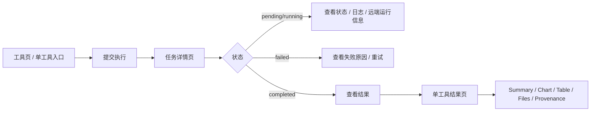

# 单工具工作台改造方案

## 背景

当前项目已经具备较完整的单工具执行底座：

- UI 通过 `ToolBridge.run_tool()` 提交执行
- `ToolBridgeService.execute_tool()` 负责输入导入、数据库路径注入、执行编排
- `ToolEngine` / `ExecutionPreparer` / `ServiceLocator` / `JobDispatcher` 负责远端准备、投递、监控与回写

真正不统一的部分主要在结果层：

- 不同工具结果页仍按 `primer / multiplex / fastp / targeted / detection workflow` 分支硬编码
- 任务状态页和结果页的路径已经存在，但用户心智仍不够稳定
- integrated 页面同时承担工作台、结果页、结果跳转，信息层级偏乱

本方案的目标不是重写执行链，而是在现有执行链之上建立统一的单工具产品层。

## 设计目标

1. 保留现有执行底座，不重写 `ToolEngine` 主链。
2. 统一“任务状态”和“结果查看”的用户路径。
3. 为任意单工具建立统一结果 schema，避免继续按 tool id 写死结果页。
4. 保留现有 QWebEngine + QWebChannel 宿主，只重排信息架构与结果渲染。
5. 支持渐进迁移，先迁简单工具，再迁 workflow 特例。

## 用户流转

单工具统一采用“两页一链”：

1. 用户从工具入口配置参数并提交运行
2. 提交后自动进入该 execution 的任务详情
3. 任务详情负责展示：
   - `pending / running / failed / completed`
   - 实时日志 / 远端状态 / 失败原因
   - 重试 / 查看结果入口
4. 任务完成后，从同一条任务记录进入单工具结果页
5. 结果页负责展示：
   - 结果摘要
   - 图表 / 表格 / HTML 预览
   - 产物文件
   - 参数与追溯信息

### 职责边界

- `状态` 属于任务
- `结果` 属于执行产物
- `入口` 必须从同一条任务记录一跳直达

### 页面流转



## 模块落点

### 保持不动或只做轻量适配

- `core/execution/tool_engine.py`
- `core/execution/execution_preparer.py`
- `core/execution/command_builder.py`
- `core/service_locator.py`

这些模块已经是比较干净的执行基座，不应在本轮改造中大动。

### 重点调整

- `core/execution/tool_bridge_service.py`

该模块收敛为：

- 执行编排
- 任务历史查询
- 调用统一结果 builder
- 少量 workflow 特例 adapter

禁止继续向该文件追加新的整页 `if tool_id == ...` 结果构建分支。

### 建议新增模块

- `core/execution/single_tool_view_schema.py`
  - 标准结果 schema 定义与辅助校验
- `core/execution/single_tool_view_builder.py`
  - 输入 `descriptor + execution + artifacts + parsed payload`
  - 输出统一 view model
- `core/execution/single_tool_result_parsers.py`
  - 放单工具结果解析逻辑与 adapter

## 统一结果 Schema

前后端统一只认一套 view model。

```json
{
  "feature_id": "fastp",
  "tool_ids": ["fastp"],
  "title": "fastp 质控",
  "description": "原始 FASTQ 质量控制结果",
  "status": {
    "state": "completed",
    "label": "已完成",
    "detail": "任务已完成，可查看质控结果"
  },
  "hero": {
    "sample_name": "S01",
    "execution_id": "exec_xxx",
    "updated_at": "2026-03-30 14:20",
    "primary_action": "view_result"
  },
  "summary": [
    {"label": "原始 Reads", "value": "1,240,000", "tone": "primary"},
    {"label": "通过过滤", "value": "1,110,000", "tone": "success"}
  ],
  "tabs": ["overview", "chart", "table", "files"],
  "charts": [],
  "table": {
    "title": "结果表",
    "subtitle": "",
    "columns": [],
    "rows": []
  },
  "artifacts": [],
  "provenance": {
    "parameters": [],
    "tool_version": "",
    "remote_result_dir": "",
    "command_preview": ""
  }
}
```

### Schema 约束

- `summary / charts / table / artifacts / provenance` 必须稳定存在
- `parameters` 归入 `provenance`
- workflow 特例也必须适配到同一 schema
- 前端不再按特定工具判断字段结构

## 任务状态页与结果页的边界

### 任务状态页负责

- 状态芯片
- 运行中日志
- 失败原因
- 远端状态块
- 重试
- 完成后“查看结果”按钮

### 结果页负责

- Hero
- 关键指标 summary
- 主结果视图
- 原始文件
- 参数 / 版本 / execution_id / output_dir

### 不再允许

- 运行中就在结果页中混入大量“假结果”
- 同一个 execution 既要去历史看状态，又要去别的 tab 猜结果
- 一个工具有多条并行的结果查看路径

## 前端信息架构

保留现有宿主：

- `ui/pages/detection_page_web.py`
- `ui/pages/detection_page_assets/index_galaxy.html`
- `ui/pages/detection_page_assets/app_galaxy.js`
- `ui/pages/detection_page_assets/styles_galaxy.css`

### 单工具结果页结构

1. 顶部 Hero
   - 工具名
   - 状态
   - 样本名
   - 最近运行时间
   - 主按钮
2. 指标区
   - 3 到 5 个关键 summary 卡片
3. 主结果区
   - `概览 / 图表 / 表格 / 文件` tabs
4. 右侧辅助区
   - 参数
   - 文件
   - 日志
   - Provenance

### UI 收口要求

- 去掉 Unicode emoji 图标
- 统一中文文案
- 把颜色、圆角、阴影、字号收口为 CSS token
- HTML 预览 / chart / table 不再纵向全部抢首屏
- 保留运行弹窗，但仅作为快速运行入口

## tool.yaml 的角色

现有 `tool.yaml` 已包含较好的单工具契约：

- `inputs`
- `outputs`
- `parameters`
- `databases`
- `usage`
- `presets`
- `result_views`

本轮改造中应强化其作用：

1. 用 `usage / presets` 改善工具运行入口
2. 用 `outputs / result_views` 驱动统一结果 builder
3. 对无法完全由声明描述的复杂工具，增加 adapter，但 adapter 仍输出统一 schema

## 迁移顺序

### 第一批试点

1. `fastp`
2. `kraken2`
3. `prokka`

原因：

- 输出结构清晰
- 结果类型具有代表性
- 覆盖 HTML / JSON / 表格 / 图表 / 文件几种常见形态

### 第二批迁移

- `primer_design`
- `multiplex_primer_panel`
- `unknown_sample_detection` 等 workflow 特例

原则：

- 简单工具先标准化
- 复杂 workflow 后适配
- 不反过来从最复杂特例开始

## 多 Agent 实施策略

先冻结方案，再并行实施。

### 不建议并行的阶段

- 方案摇摆期
- schema 未冻结前
- 前后端职责边界未定前

### 适合并行的阶段

#### Agent 1：后端 schema + builder

负责：

- `single_tool_view_schema.py`
- `single_tool_view_builder.py`
- `single_tool_result_parsers.py`
- `tool_bridge_service.py` 的结果分发收敛

#### Agent 2：前端单工具结果页重排

负责：

- `index_galaxy.html`
- `app_galaxy.js`
- `styles_galaxy.css`

目标：

- tabs 化主结果区
- 增强 Hero
- 收紧信息层级
- 去 emoji / 去中英混搭

#### Agent 3：试点工具接入与测试

负责：

- `fastp`
- `kraken2`
- `prokka`
- 相关测试用例补齐

### 并行边界

- Agent 1 不改前端资源文件
- Agent 2 不改后端 schema 定义
- Agent 3 只按既定 schema 迁移工具，不自行扩 schema

## 第一批实施范围

### 后端

- 新增统一 view schema / builder
- 历史结果加载改为通用分发
- 为 `fastp / kraken2 / prokka` 提供 adapter

### 前端

- 在 integrated 结果区引入 tabs
- 固定任务状态跳结果页的主路径
- 统一空状态与按钮样式

### 测试

- 新 builder 单测
- 试点工具 view 生成测试
- 历史页“查看结果”通路测试

## 验收标准

以下条件同时满足才算完成第一批改造：

1. 用户提交 `fastp / kraken2 / prokka` 任一工具后，可先在任务详情查看状态
2. 任务完成后，可从同一条任务记录进入结果页
3. 三个工具都通过统一 schema 渲染结果页
4. 前端不再按工具名硬编码不同结果页面协议
5. 不新增主线程 SSH/阻塞调用
6. 不引入 silent fallback

## 风险与约束

- workflow 特例较多，必须坚持 adapter 思路，禁止把统一 builder 重新写成新的大分支
- 结果 parser 可能逐步增多，应集中管理，避免再次回流到 `tool_bridge_service.py`
- UI 改造只能重排结构，不应破坏既有 QWebChannel 通讯模式
- 任何远端操作仍必须走 `SSHService.run()` 与现有串行队列

## 结论

本轮改造本质上是：

- 保留执行底座
- 统一结果 schema
- 稳定任务状态到结果页的单线闭环
- 让 integrated 页面从“杂糅工作台”收敛为“清晰的单工具产品页”

只要先冻结 schema 和页面职责，多 agent 并行就会高效；如果在 schema 未定前并行改代码，结果一定会漂移。
