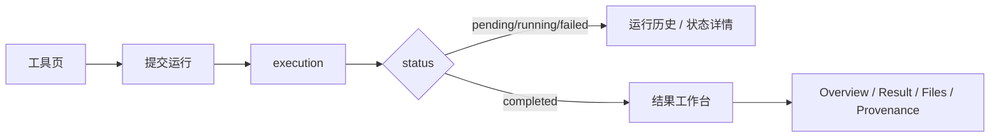

# H2OMeta 2026 结果工作台改造方案

## 摘要

本方案是当前仓库中关于“插件工作台 / 运行历史 / 结果工作台”改造的唯一有效主方案。

改造目标：

- 工具页只负责配置与提交
- history 负责 execution 列表与状态详情
- results 负责 completed execution 的统一结果页
- 第一阶段不改执行底座，不新增持久化状态，不引入 agent / Nextflow backend
- 先修 execution 旅程与页面职责，再做 2026 风格的 `Data Cockpit` 视觉升级

本方案按大型项目渐进重构最佳实践组织：

- 只保留一份 canonical 文档
- 每阶段有明确 gate
- 明确“不改什么”
- 明确回滚点
- 明确试点工具
- 明确验收标准

## 当前问题

当前问题不是单个 widget 缺失，而是产品自洽性不足：

1. `integrated` 同时承担 workflow 入口、结果详情页、历史结果落点。
2. 运行成功后只弹提示并刷新，用户没有明确的 execution 去向。
3. history、status、result 在不同状态下切换不同页面模型，缺乏唯一 execution 旅程。
4. integrated 页中 html/chart/table/sections/files/provenance/run entry 平权堆叠，主次关系不清晰。
5. 当前 CSS/DOM 存在语义与视觉层级混乱，不适合直接“换皮式”升级。

## 目标信息架构

### 顶层意图

- `工具`
- `运行历史`
- `结果`
- `数据库`

### 核心旅程

### 结果页固定结构

- `Overview`
  - summary
  - sections
- `Result`
  - html/chart/table 主视图
- `Files`
  - artifacts
- `Provenance`
  - 参数、版本、目录、execution_id

## 冻结边界

首轮改造明确不动：

- `ToolEngine.execute()`
- SSH / `SSHService.run()` / `JobDispatcher`
- execution 状态枚举
- bridge API
- `tool.yaml`
- artifact manifest

现有结果协议继续复用：

- `summary`
- `charts`
- `table`
- `artifacts`
- `provenance`
- `sections`
- `archetype`

## Phase 0：冻结接口与设计基线

目标：

- 统一产品概念与页面职责
- 冻结不可变接口
- 建立视觉系统基线，但不修改执行行为

要求：

- `tools` 语义固定为工具配置与提交
- `history` 语义固定为 execution 列表与状态详情
- `integrated` 语义上收口为统一结果壳宿主
- workflow 入口不再默认等于结果落点

UI 基线：

- 风格目标：`Data Cockpit`
- 信息密度：`中等密度`
- 语言基线：中文产品文案为主
- 状态 token：`pending / running / failed / completed`

Gate：

- 不允许在 Phase 0 改执行链
- 不允许新增数据库迁移或持久化状态

## Phase 1：统一 execution 路由

目标：

- 解决“点运行后去哪看”的核心问题

改动范围：

- `ui/pages/detection_page_assets/app_galaxy.js`

改动内容：

- 新增统一 `openExecution(executionId, recordOrContext)`
- 所有入口统一走它：
  - `onRunResult()`
  - history actions
  - 查看结果入口
- 路由规则固定：
  - `pending/running/failed` -> history 中状态详情
  - `completed` -> `get_results_for_execution()` -> 结果壳
- `onRunResult()` 必须利用返回的 `execution_id` 自动聚焦 execution

本阶段不做：

- 不改 tabs
- 不做视觉重构
- 不加新 schema
- 不改 backend builder

Gate：

- 运行后自动定位对应 `execution_id`
- history 与运行成功入口共用同一路由
- 空 history / 无项目 / 无样本 / SSH 未连接时不崩溃

Rollback：

- 保留原有 history 渲染和手动“查看结果”通路
- 若新路由异常，可退回为仅手动进入结果的模式

## Phase 2：把 integrated 区收口成统一结果壳

目标：

- 解决 integrated 三重人格问题

改动范围：

- `ui/pages/detection_page_assets/index_galaxy.html`
- `ui/pages/detection_page_assets/app_galaxy.js`

改动内容：

- integrated detail 区重组为统一结果页
- 固定二级结构：
  - `Overview`
  - `Result`
  - `Files`
  - `Provenance`
- 固定映射：
  - `Overview` -> summary + sections
  - `Result` -> html/chart/table
  - `Files` -> artifacts
  - `Provenance` -> 参数、版本、目录、execution_id
- 从 history 进入结果时隐藏 workflow run entry
- 从 workflow 入口进入时保留 run entry

本阶段不做：

- 不重写 DOM 宏结构
- 不改 payload
- 不做大规模 CSS 美化

Gate：

- integrated 不再默认同时承担 workflow 启动和历史结果落点
- `Overview / Result / Files / Provenance` 固定存在
- completed execution 从 history 进入时只看到结果壳

Rollback：

- 保留原 integrated DOM 宏布局
- 通过 show/hide 退回旧逻辑，而不是直接删除原块

## Phase 3：升级为 typed result UX

目标：

- 让前端真正按现有 schema 工作，而不是继续靠页面堆块

改动范围：

- `ui/pages/detection_page_assets/app_galaxy.js`
- 必要时轻量适配 `core/execution/single_tool_view_builder.py`
- 必要时轻量适配 `core/execution/tool_bridge_service.py`

改动内容：

- 前端显式按 `archetype` 选择主 viewer：
  - `table-first`
  - `chart-first`
  - `html-first`
  - `files-first`
- `sections` 提升为主内容区 cards
- 结果页层级固定为：
  - hero / primary result
  - supporting result cards
  - utility / files / provenance

试点工具：

- `blastn`
- `fastp`
- `prokka`

本阶段不做：

- 不新增 execution 持久化状态
- 不引入 Nextflow backend
- 不做 agent

Gate：

- `blastn`：表格主视图正确
- `fastp`：summary + chart/html 正确
- `prokka`：summary + table + files 正确
- `sections` 在主内容区而不是旁注
- 缺少 html/chart/file 时显式错误态，不 silent fallback

Rollback：

- 继续复用现有 builder
- 若某工具视图不稳定，可临时回退到现有统一壳中的基础 table/files 展示

## Phase 4：Data Cockpit 视觉重设

目标：

- 在语义自洽后，再做 2026 风格现代化

改动范围：

- `ui/pages/detection_page_assets/styles_galaxy.css`
- 视情况轻调 `index_galaxy.html`

前置条件：

- Phase 1-3 全通过
- 页面职责稳定
- visual token 先定义后替换

必须先做的样式系统收口：

- typography scale 统一
- spacing scale 统一
- state token 统一
- card tiers 统一
- 按钮体系统一
- 移除破坏设计系统的 inline styles

视觉目标：

- execution hero 成为首屏焦点
- summary cards 节奏统一
- 主结果 viewer 优先
- files/provenance 次级化
- history 改造成 run list card，而不是功能堆叠折叠列表
- 去掉 emoji 和英文遗留文案

Gate：

- history、hero、summary 共用统一状态 token
- typography/spacing 不再跨模块漂移
- 主次卡片层级清晰
- 新视觉建立在正确职责划分之上，而不是旧语义换皮

Rollback：

- token 化替换逐步推进
- 若局部视觉改造不稳定，可退回旧 token 值但保留新结构

## Phase 5：后续可选增强

仅在前 1-4 阶段稳定后评估：

- `ExecutionBackend` 抽象
- `CommandBackend / NextflowBackend`
- richer typed artifact metadata
- 单独 execution detail 页面
- 未来 agent 辅助层

禁止事项：

- 不允许把当前 UI 自洽问题转嫁到“换 backend”“接 agent”“重做 server”上

## 验收与回归

### Documentation Gate

- `docs/结果工作台2026分阶段改造方案.md` 成为唯一主方案
- 两份旧文档删除
- `docs/README.md` 指向新文档
- 代码实现和文档 phase 名称、gate、试点工具保持一致

### Regression Guardrails

- 不新增主线程 SSH 调用
- 不新增 execution 持久化状态
- 不改 `ToolEngine.execute()` 语义
- 不破坏现有 `查看结果` 主通路
- 所有失败显式报出，不做 silent fallback

## 文档替换说明

本文件替换以下旧文档：

- `docs/单工具工作台改造方案.md`
- `docs/代码分析_集成分析工作台.md`

后续若继续推进该主题，只允许更新本文件，不再新增平行方案文档。
